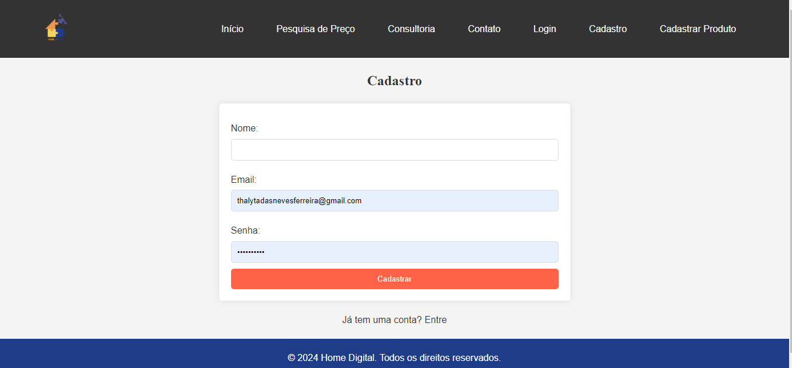
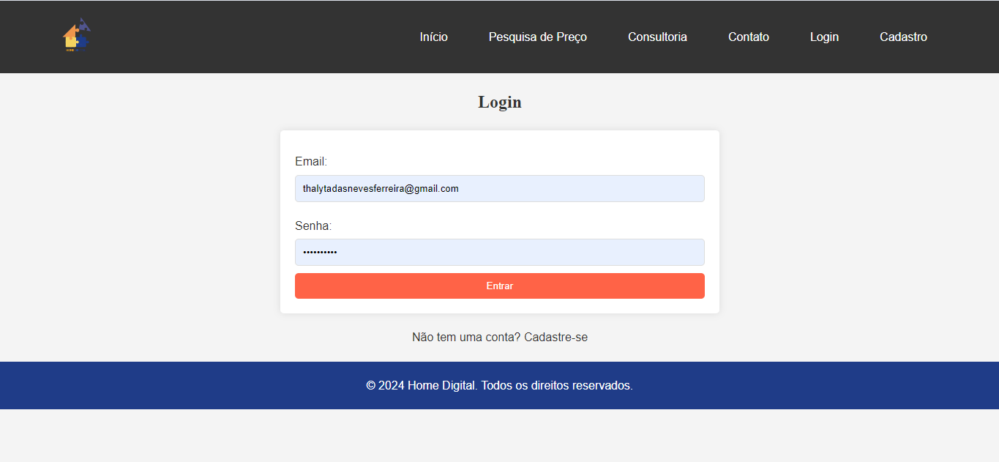

# Projeto - Aplicação de Cadastro e Login

## Índice

[Descrição](#descri%C3%A7%C3%A3o)

[Introdução](#introdu%C3%A7%C3%A3o)

[Funcionalidades](#funcionalidades)

[Tecnologias Utlizadas](#tecnologias-utilizadas)

[Autores](#autores)

## Descrição

Este projeto oferece as funcionalidades de Cadastro e Login para a plataforma Home Digital, que é voltada para o gerenciamento de reformas e decorações. As telas permitem que os usuários se registrem e autentiquem, garantindo o acesso seguro às funcionalidades da plataforma, como pesquisa de preços e consultoria de design de interiores.

## Introdução

A plataforma Home Digital exige que os usuários criem uma conta ou façam login para acessar os recursos personalizados, como a consultoria de design e o cadastro de produtos. Este sistema de Cadastro e Login é responsável pela autenticação e gerenciamento dos usuários. Ele foi desenvolvido com foco em simplicidade e usabilidade, oferecendo uma experiência de usuário eficiente tanto no cadastro quanto no login.

## Funcionalidades

`Cadastro de Usuários:` A tela de cadastro permite que novos usuários insiram seu nome, e-mail e senha para criar uma conta.

`Login de Usuários:` Após o cadastro, os usuários podem inserir seu e-mail e senha na tela de login para acessar sua conta.

`Validação de Dados:` Durante o cadastro, há uma verificação para garantir que todos os campos obrigatórios (nome, e-mail, senha) estejam preenchidos corretamente.

`Autenticação:` A funcionalidade de login verifica as credenciais fornecidas e, se corretas, permite o acesso à conta do usuário.

`Feedback Visual:` Tanto no cadastro quanto no login, botões e campos de entrada oferecem feedback visual (mudanças de cor) para melhorar a interação do usuário.

## Tecnologias Utilizadas

- **HTML5**: Criação das estruturas das páginas de cadastro e login.

 

- **CSS3**: Estilização das telas para uma interface moderna e responsiva.

- **JavaScript**: Validações de frontend nos formulários para garantir o preenchimento correto dos campos.

- **PHP**: Gerenciamento das operações de backend, incluindo a inserção de novos usuários no banco de dados e a verificação de credenciais de login.

- **MySQL**: Banco de dados usado para armazenar os dados de cadastro dos usuários.

## Autores
Equipe Home Digital - Desenvolvimento geral da plataforma 

* A equipe da Home Digital é composto por: HELOÁ D'ANDREA SOUZA NASCIMENTO, TALYTA AUGUSTO ARAUJO, NICOLLY DA SILVA D`AVILA, THALYTA DAS NEVES FERREIRA & GABRIEL RODRIGUE DOS SANTOS
